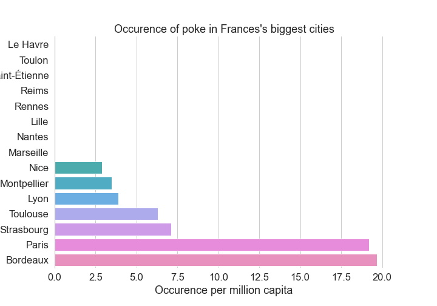

# Où ouvrir mon restaurant de Poké ?

Ces dernières années, nous voyons naître de plus en plus de restaurant de Poké, ou « Poké bar » à travers la France. Il s’agit d’une spécialité culinaire venu d’Hawaï. Pour ceux qui ne sont pas familiers voici une photo de cette merveille : 

     
    <a href="https://www.freepik.com/photos/food">Food photo created by timolina - www.freepik.com</a>

 
L’objectif de ce notebook est de déterminer l’offre concurrentielle à travers les principales villes de France. Nous allons plus concrètement :<ul>
<li>Identifier les restaurants de Poké qui se trouvent dans les 15 plus grandes villes du territoire français</li>
<li>Rapporter le nombre de restaurant trouvés à la population de la ville (cela nous donnera un indicateur de la part de marché de Poké de ces restaurants)</li>
<li>Présenter le résultat de l’étude sur un graphique</li>
</ul>
 
Je vous invite donc à consulter le notebook pour voir l’analyse réalisée à l'aide de la base de données *Foursquare* :   
<ul><li><a href="https://nbviewer.jupyter.org/">Lien vers le notebook</a></li></ul>
 
Sinon, voici le résultat de l'analyse en une image :
    
 
Nous pouvons en conclure que les villes tels que Marseille, Nantes ou Lille sont des agglomérations où il y a une concurrence très faible. Il serait donc pertinent d’ouvrir nos restaurants de Poké dans ces villes !
 
 
*Note : Il s’agit là d’une analyse très sommaire du sujet. Une analyse plus fine pourra être réaliser, pour par exemple, déterminer le type de quartier dans lesquels ces restaurants sont implantés, ou encore, de déterminer la fréquentation de ces établissements.*